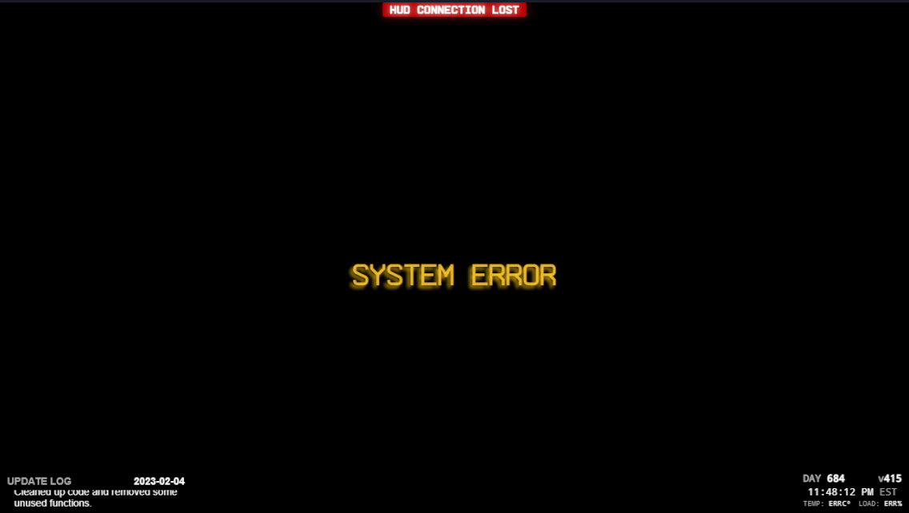

# About

A HUD designed for the FumoCam projects, intended to be used as an OBS browser source.

Does not require a webserver to host, can add HTML file directly to the browser source.

Utilizes websockets for process communication.

Will eventually require (LibreHardwareMonitor)[https://github.com/LibreHardwareMonitor/LibreHardwareMonitor] as that can be polled directly in the HTML's javascript instead of OpenHardwareMonitor (who's sensor server raises CORS issues and requires a seperate backend "translator" over websockets)

# Example images

### "Connection Lost" appearance

# Installing

## 1. Config

Create a new file called `config.js`. Use the values in `config.example.js` to populate.

## 2. Add to OBS

Create a new browser source in OBS. For the settings,

- Check `Local File`
- Click the Browse button and select the HTML file for the `Local File` field
- Set `Width` to `1280` (Designed for 720p)
- Set `Height` to `720` (Designed for 720p)
- Check `Use custom frame rate`
- Check `Control audio via OBS`
- Set `FPS` to `30`
- For Custom CSS, add `html, body { background-color: rgba(0, 0, 0, 0); margin: 0px auto; overflow: hidden; }` (To keyframe-out the gray background)
- Check `Shutdown source when not visible` (Allows toggling of the OBS element for easy updating)
- According to your personal preferences, check `Refresh browser when scene becomes active`

Then, in OBS settings, it is recommended to go to the `Advanced` tab and uncheck `Enable Browser Source Hardware Acceleration` (at the bottom) for better stability.

An OBS restart may be necessary.

# Private Assets.

Some items are third party/private and are only included in a seperate, private repository.

You can raise an issue requesting access to the [private repo](https://github.com/FumoCam/HUD-PrivateAssets) if you intend to contribute.

Otherwise, they can manually be replaced as you wish.

## Items in "Private Assets" repository:

- autoaimon.mp3
- fonts/
  - arame/
    - Arame.ttf
    - Arame-Bold.ttf
    - ArameMono.ttf
    - ArameMono-Bold.ttf
    - ArameMono-Stencil.ttf
    - ArameMono-Thin.ttf
    - Arame-Stencil.ttf
    - Arame-Thin.ttf
  - droidsans/
    - DroidSansMono.ttf
    - license.txt
